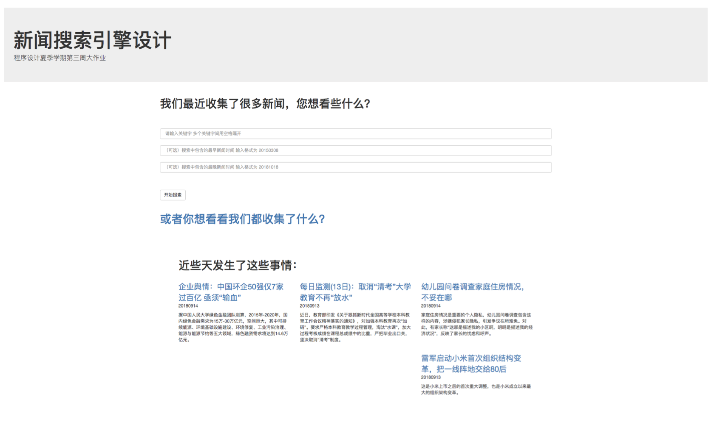
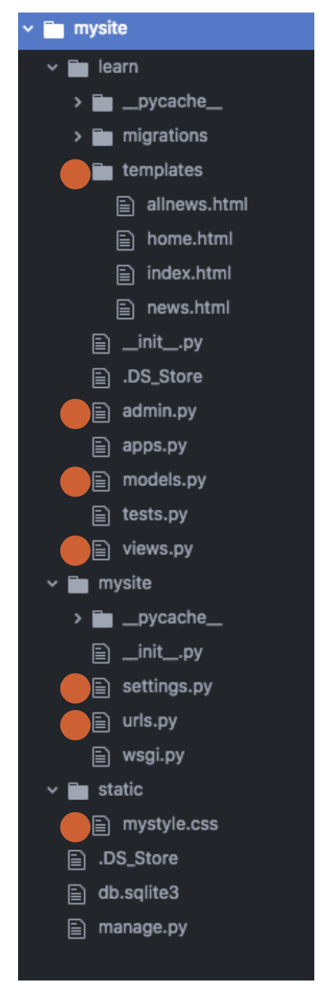
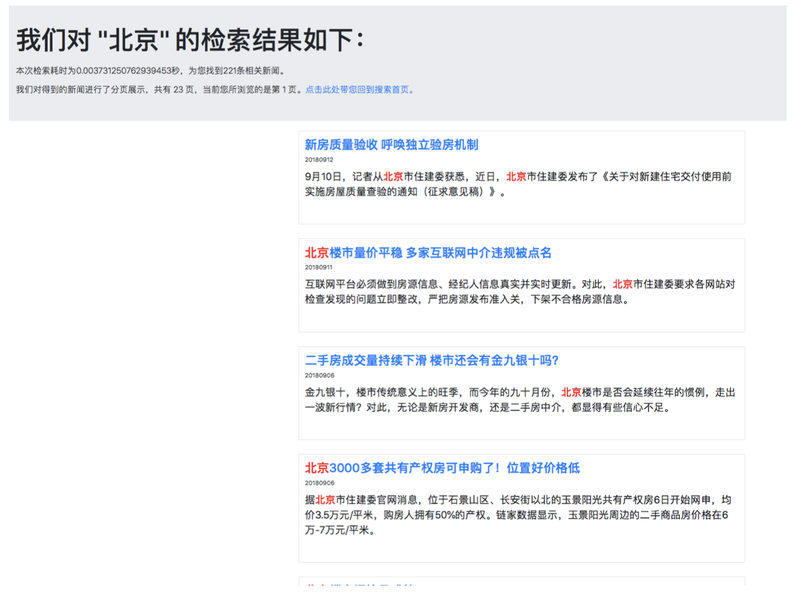
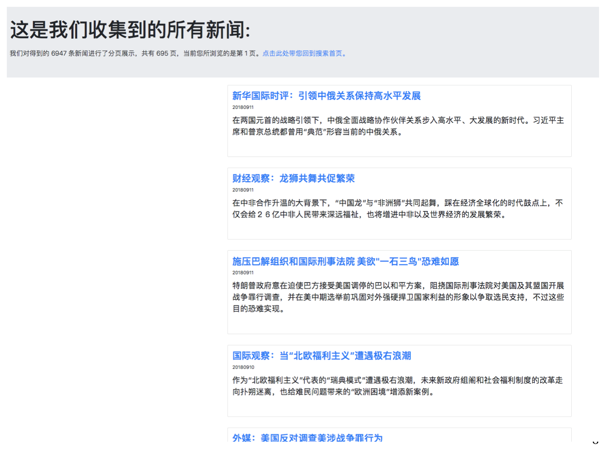
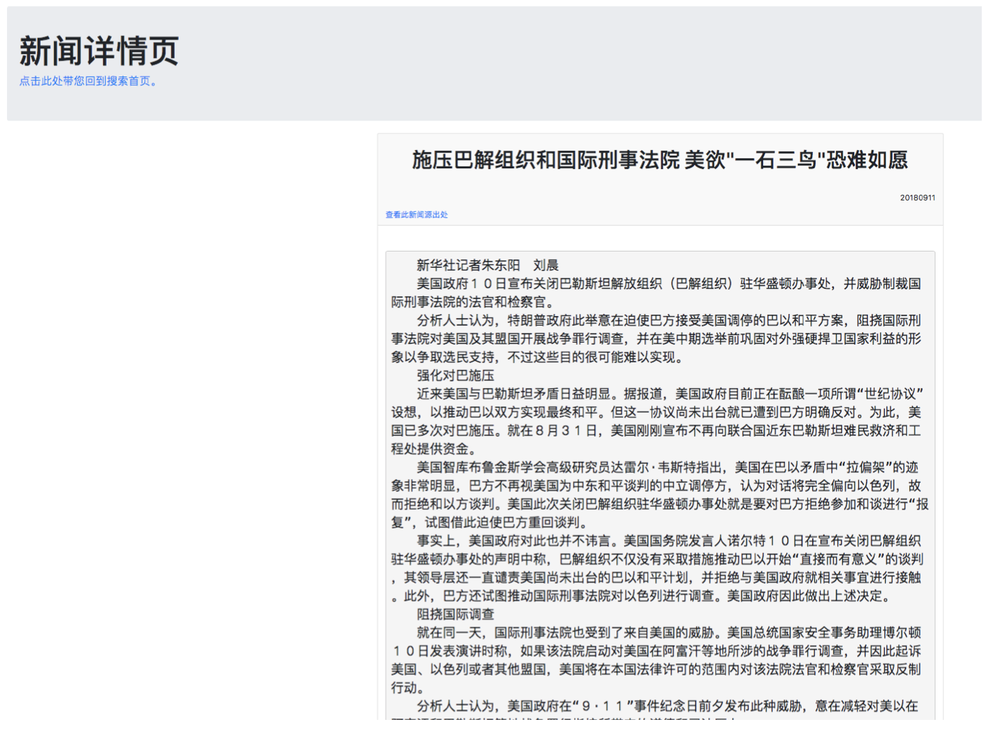

# 新闻信息整合与检索系统

综合运用了 Python3 Jieba BeautifulSoup4 RE Django HTML CSS Javascript Mysql Bootstrap4 等技术搭建了新闻搜索引擎。

## 数据收集

分为三部分:获取URL、获取全文以及关键字处理。 

第一部分:

从新华网的不同板块出发，首先采集新闻链接 url 、新闻标题 title 和新闻摘要 summary ，存入 Mysql 数据库。以自建 id 为关键字(以采集次序自增)，在向数据库 中加入数据时对 url 查重，确保 url 唯一，并对在采集过程中可能出现的错误进行了预处理，避免运行时报错，降低效率。

第二部分:

从数据库中收集的 url 出发，利用 BeautifulSoup4 和 正则表达式 逐条寻找每篇新闻的发布时间 date 和新闻全文 text ，并对在采集过程中可能出现的错误进行了预处理，避免运行时报错，降低效率。

第三部分:

对数据库中每条新闻的摘要和全文做分词处理(搜索引擎模式)，整理并统计词频，并将重要的关键字写入数据库。整理关键字时，为确保搜索效率，做出了如下规定:

1. 关键字长度大于1;

2. 关键字词频大于3;

3. 以词频为主要权重，倒序排列，最多取10个关键字写入数据库。

对得到的关键字建立倒排列表，便于后续索引。对在采集过程中可能出现的错误 进行了预处理，避免运行时报错，降低效率。

## 网站搭建

首先建立 project 命名为 mysite ，在建立 app 命名为 learn 。 文件目录如图:

主要操作的是红色标注的几个文件:

templates只要存储我使用的网页模版，四个模版由上至下别是:整合所有新闻并展示的页面、搜索首页、搜索结果 显示页面、新闻详情页面。

admin.py 是我后台整理数据的操作文件。

models.py 是使用 MVC 架构时与数据库接轨的一个操作文件。

views.py 是使用 MVC 架构时处理model传来的数据，并将数据发送到html模版中的操作文件。

settings.py 是管理项目设置的文件。

urls.py 是处理不同url与view.py不同函数对接关系的操作文件。

mystyle.css 是CSS文件，为了设计并美化html模版而用。

## 页面说明

- 搜索首页

构建了一个POST表单，里面包含三个搜索栏，一个提交按钮。

关键字搜索必需项，支持多关键词搜索，两个时间搜索为可选项。点击提交后，会自动判断有无时间限定。

多个关键词输入后，我们会将关键词分开，对每个关键词设立权值，单独搜索，最后整合搜索结果，若有时间限定，我们再过滤掉不合法的时间，按权值大小展示结果，得到最优的答案。

页面中“或者你想看看我们都收集了什么?”可以链接到“所有新闻页面”的第一页。

“近些天发生了这些事情:”会收集最近日期的热点新闻，并展示出来。

- 搜索结果页面

得到关键字之后，在 views.py 中执行相应函数，在数据库中进行检索，得到数据后，将数据传递给 index.html 模版，进行展示。

检索耗时:计算了函数开始检索到检索完毕的耗时;

分页显示:(后端分页模式)在传递新闻条目时，并不是全部传递到模版。每页只显示10条结果，每次回传递当前页页码和所对应的十条结果，当点击下一页的时候，采用GET方法获取想要显示的页码，在对应好数据，传递给模版。

关键字高亮:采用前端 Javascript 方法，对带有特定id的板块进行关键字正则匹配，对其添加额外的标签。

- 所有新闻页面

- 新闻详情页面

利用GET方法得到新闻id之后，在 views.py 中执行相应函数，在数据库中进行检索，得到数据后，将数据传递给 news.html 模版，进行展示。

相关新闻:获取到当前新闻的第一个和第二个关键字，以该关键字再次进行检索，将得到的结果展示出来，只展示最相关的前四个。

## 具体实现

请移步源代码，那里有比较详细的注释说明。
